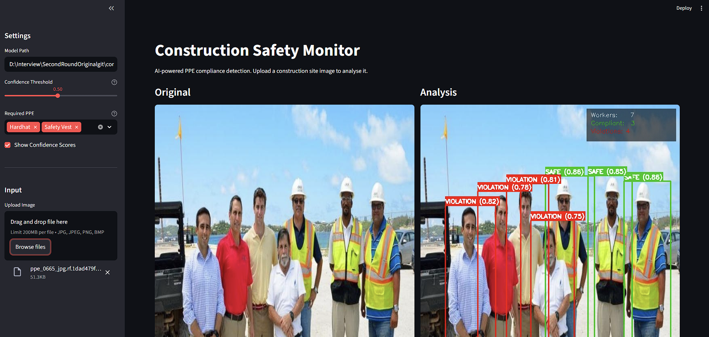

# Construction Safety Monitor

AI-powered computer vision system that monitors construction sites in real time, detecting workers, identifying PPE compliance (hard hats, high-visibility vests, and masks), and flagging safety violations.

Built with **YOLOv8** for object detection and a custom **rule engine** for compliance checking.




---

## Table of Contents

- [Project Structure](#project-structure)
- [Quick Start](#quick-start)
- [How It Works](#how-it-works)
- [How YOLOv8 Works](#how-yolov8-works)
- [Dataset](#dataset)
- [Safety Rules](#safety-rules)
- [Model Performance](#model-performance)
- [Known Limitations](#known-limitations)
- [Future Improvements](#future-improvements)

---

## Project Structure

```
construction-safety-monitor/
├── data/
│   ├── dataset/              # Kaggle dataset (not in git - see below)
│   ├── sample_images/        # Small set of images for quick demo
│   ├── download_dataset.py   # Kaggle download helper
│   └── README.md             # Full dataset documentation
├── notebooks/
│   ├── 01_data_exploration.ipynb
│   ├── 02_training.ipynb
│   └── 03_evaluation.ipynb
├── src/
│   ├── config.py             # Class mappings, paths, thresholds
│   ├── detector.py           # YOLOv8 wrapper
│   ├── utils.py              # Spatial worker-PPE pairing
│   ├── safety_rules.py       # Compliance rule engine
│   ├── violation_tracker.py  # Temporal tracking for video
│   └── annotator.py          # Frame annotation and reports
├── app/
│   └── streamlit_app.py      # Interactive web demo
├── tests/
│   ├── test_safety_rules.py
│   └── test_detector.py
├── inference.py              # CLI inference script
├── requirements.txt
└── README.md
```

---

## Quick Start

### 1. Clone and Install

```bash
git clone https://github.com/SahansilvaDev/construction-safety-monitor
cd construction-safety-monitor
uv venv
uv pip install -r requirements.txt
```

### 2. Get the Dataset

Download from [Kaggle](https://www.kaggle.com/datasets/snehilsanyal/construction-site-safety-image-dataset-roboflow) and extract into `data/dataset/`. The download already includes pre-trained weights.

Or use the helper script:

```bash
uv run python data/download_dataset.py
```

### 3. Run Inference (Using Pre-trained Weights)

The Kaggle download includes a YOLOv8n model already trained for 100 epochs. You can use it immediately:

```bash
# Single image
uv run python inference.py --source path/to/image.jpg

# Folder of images
uv run python inference.py --source data/dataset/css-data/test/images/

# Video file
uv run python inference.py --source data/dataset/source_files/source_files/hardhat.mp4

# Webcam
uv run python inference.py --source 0
```

### 4. Train Your Own Model (Optional)

Open `notebooks/02_training.ipynb` in Google Colab with a T4 GPU runtime. The notebook handles dataset setup, training, and saving the best weights to Google Drive.

### 5. Launch Demo App

```bash
uv run streamlit run app/streamlit_app.py
```

Browser opens at `http://localhost:8501`. Upload a construction site image to analyse PPE compliance.

### 6. Run Tests

```bash
uv run pytest tests/ -v
```

---

## How It Works

The system operates as a 5-stage pipeline:

```
Frame
  │
  ▼
1. YOLOv8 Detection
   Detects all objects: Person, Hardhat, NO-Hardhat,
   Safety Vest, NO-Safety Vest, Mask, NO-Mask, etc.
  │
  ▼
2. Worker-PPE Pairing  (src/utils.py)
   Matches each PPE detection to the correct worker
   using head region (top 30%) and torso region (middle 40%)
  │
  ▼
3. Compliance Check  (src/safety_rules.py)
   Checks each worker against required PPE rules
   Supports zone-based rules (different areas = different requirements)
  │
  ▼
4. Violation Tracking  (src/violation_tracker.py)
   For video: only report violations that persist 10+ frames
   Eliminates single-frame false positives
  │
  ▼
5. Annotation + Report  (src/annotator.py)
   Green box = safe, Red box = violation
   Summary panel + full text report
```

---

## How YOLOv8 Works

YOLOv8 processes the entire image in one forward pass through a neural network.

### Architecture Overview

```
Input (640×640)
  → Backbone (CSPDarknet)   — extracts features at multiple scales
  → Neck (FPN + PAN)        — fuses small and large scale features
  → Head (decoupled)        — predicts boxes, classes, confidence
  → NMS                     — removes duplicate detections
  → Detections [(bbox, class, confidence), ...]
```

### Why One Pass?

Traditional detectors propose regions first, then classify each one (slow). YOLO divides the image into a grid and predicts everything simultaneously — fast enough for real-time video.

### Why Transfer Learning?

We start from COCO-pretrained weights (80 classes, millions of images). The model already knows shapes, textures, and bodies. We fine-tune on our 10-class construction dataset — much faster and more accurate than training from scratch.

### Model Sizes

| Model | Parameters | Speed (GPU) | mAP (COCO) | Use Case |
|-------|-----------|-------------|------------|----------|
| YOLOv8n (nano) | 3.2M | Fastest | 37.3 | Edge devices, mobile |
| YOLOv8s (small) | 11.2M | Fast | 44.9 | Good accuracy/speed balance |
| YOLOv8m (medium) | 25.9M | Moderate | 50.2 | Higher accuracy needs |

We use **YOLOv8n** for this project because it's fast enough for real-time monitoring and fits within Colab free-tier GPU constraints.

---

## Dataset

**Source:** [Construction Site Safety Image Dataset](https://www.kaggle.com/datasets/snehilsanyal/construction-site-safety-image-dataset-roboflow) (Kaggle)

Originally from [Roboflow Universe](https://universe.roboflow.com/roboflow-universe-projects/construction-site-safety), with images collected from YouTube surveillance videos and multiple Roboflow PPE detection projects.

### Why This Dataset?

The key feature is **dual-class labelling**: it annotates both `Hardhat` and `NO-Hardhat`, `Safety Vest` and `NO-Safety Vest`. This lets the model *actively detect the absence of PPE*, which is more reliable than inferring a violation from a missing detection.

### Statistics

| Split | Images |
|-------|--------|
| Train | 2,605 |
| Valid | 114 |
| Test | 82 |
| **Total** | **2,801** |

### 10 Classes

| ID | Class | Role |
|----|-------|------|
| 0 | Hardhat | PPE present |
| 1 | Mask | PPE present |
| 2 | NO-Hardhat | Violation indicator |
| 3 | NO-Mask | Violation indicator |
| 4 | NO-Safety Vest | Violation indicator |
| 5 | Person | Worker detection |
| 6 | Safety Cone | Scene context |
| 7 | Safety Vest | PPE present |
| 8 | machinery | Scene context |
| 9 | vehicle | Scene context |

See [data/README.md](data/README.md) for full dataset documentation including augmentation details and licensing.

---

## Safety Rules

### Defined Rules

| Rule ID | Rule | Required PPE | Severity | When Triggered |
|---------|------|-------------|----------|----------------|
| R1 | Hard Hat Required | Hardhat | **Critical** | `NO-Hardhat` detected or no helmet found in head region |
| R2 | High-Visibility Vest Required | Safety Vest | **High** | `NO-Safety Vest` detected or no vest found in torso region |
| R3 | Face Mask Required (optional) | Mask | Medium | Only enforced when explicitly enabled |

### What Counts as a Violation

| Scenario | Detection Output | Compliance Result |
|----------|-----------------|-------------------|
| Worker wearing hardhat + vest | `Person` + `Hardhat` + `Safety Vest` | SAFE |
| Worker without hardhat | `Person` + `NO-Hardhat` + `Safety Vest` | VIOLATION (R1) |
| Worker without vest | `Person` + `Hardhat` + `NO-Safety Vest` | VIOLATION (R2) |
| Worker without any PPE | `Person` + `NO-Hardhat` + `NO-Safety Vest` | VIOLATION (R1 + R2) |
| Distant worker, PPE unclear | `Person` only (no PPE detected) | VIOLATION (flagged with low confidence) |

### Zone-Based Rules (Advanced Feature)

Different areas of a site can have different requirements:

```python
from src.safety_rules import SafetyRuleEngine, Zone, Severity

zones = [
    Zone(
        name="scaffolding",
        polygon=[(0,0),(300,0),(300,400),(0,400)],
        required_ppe=["Hardhat", "Safety Vest", "Mask"],
        severity=Severity.CRITICAL,
    )
]
engine = SafetyRuleEngine(zones=zones)
```

---

## Model Performance

**Model:** YOLOv8n (nano) fine-tuned on the CSS dataset.
**Training:** Stopped at epoch 94 via early stopping (best checkpoint: epoch 84, patience=10).
**Hardware:** Tesla T4 GPU — total training time 1.307 hours.

### Overall Metrics

| Split | mAP@50 | mAP@50-95 | Precision | Recall |
|-------|--------|-----------|-----------|--------|
| Validation (114 images) | **0.803** | **0.498** | **0.862** | **0.740** |
| Test (82 images) | **0.745** | **0.457** | **0.911** | **0.681** |

### Per-Class Results (Test Set)

| Class | mAP@50-95 | Notes |
|-------|-----------|-------|
| Hardhat | 0.581 | Strong — large, distinct shape |
| Mask | 0.548 | Strong — clear visual pattern |
| Safety Vest | 0.577 | Strong — bright colour |
| machinery | 0.589 | Strong — large objects |
| Person | 0.519 | Good — benefits from COCO pretraining |
| NO-Safety Vest | 0.491 | Moderate |
| vehicle | 0.444 | Moderate — varied shapes |
| NO-Mask | 0.333 | Harder — subtle difference from Mask |
| NO-Hardhat | 0.272 | Hardest — easily confused with background |
| Safety Cone | 0.211 | Few training examples |

### Training Progression

Early stopping triggered at epoch 94 (best epoch 84):

- Training box loss: 1.37 → 0.79 (42% reduction)
- Training cls loss: 3.06 → 0.57 (81% reduction)
- Validation mAP@50: 0.25 → 0.80 (220% improvement)

### Confidence Threshold Analysis

A sweep across confidence thresholds shows that **conf=0.35 maximises mAP@50** (0.806):

| Threshold | Precision | Recall | mAP@50 |
|-----------|-----------|--------|--------|
| 0.25 | 0.913 | 0.681 | 0.802 |
| **0.35** | **0.900** | **0.685** | **0.806** ← recommended |
| 0.50 | 0.944 | 0.635 | 0.792 |
| 0.70 | 0.966 | 0.521 | 0.742 |
| 0.80 | 0.975 | 0.374 | 0.671 |

The default threshold of 0.50 costs ~1.4 mAP points. For deployment, **conf=0.35** is the recommended operating point.

### What These Numbers Mean

- **Precision 0.911** — when the model flags a violation, it is correct 91% of the time. Very low false alarm rate — important for safety systems where alert fatigue is a real risk.
- **Recall 0.681** — catches 68% of real violations. Some are missed, especially distant or occluded workers.
- **NO-Hardhat mAP 0.272** — the hardest class. A bare head is visually subtle, especially at distance. This is where the most missed violations come from.
- **mAP@50 0.745** on the unseen test set — solid generalisation for a nano model trained in ~1 hour.

---

## Known Limitations

1. **Distant workers** — Detection accuracy drops for small bounding boxes (workers far from camera)
2. **Heavy occlusion** — When workers overlap, PPE pairing may assign equipment to the wrong worker
3. **Night / low-light** — Training data is primarily daytime; low-light performance is untested
4. **Partial PPE** — The model detects presence/absence but cannot tell if PPE is worn *correctly* (e.g., helmet not fastened)
5. **Small validation set** — Only 114 validation images; metrics could shift with a larger eval set
6. **YOLOv8n size** — The nano model trades accuracy for speed; a larger model (YOLOv8s/m) would improve detection at the cost of inference time

---

## Future Improvements

- **Object tracking** (DeepSORT / ByteTrack) for consistent worker IDs across video frames
- **Edge deployment** with TensorRT / ONNX for embedded cameras
- **Additional PPE** — goggles, gloves, harness detection
- **Pose estimation** for unsafe posture detection (working at height without fall protection)
- **Alert system** with email/SMS notifications for persistent violations
- **Historical dashboard** with violation analytics over time
- **Larger model** (YOLOv8s) for improved accuracy in safety-critical applications

---

## License

MIT
